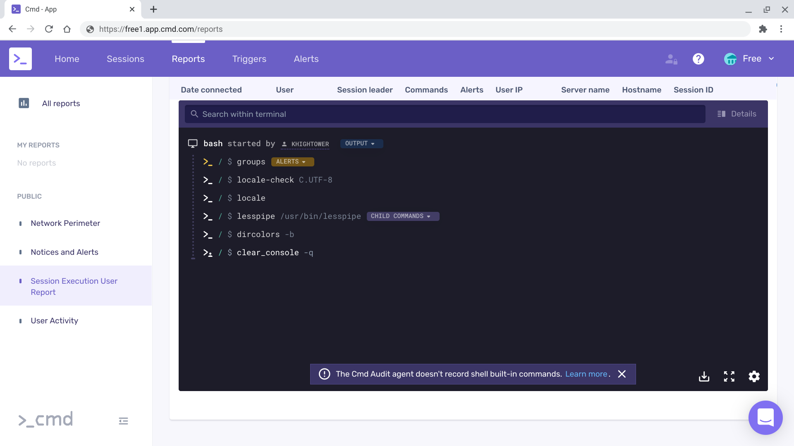

# CMD Tutorial

This tutorial will walk you through provisioning some VMs on [GCP](https://cloud.google.com) so you can kick the tires on [Cmd](https://cmd.com/) -- Track and Control Users in Production.

## Setup CMD

Walk through the initial [installation instructions](https://help.cmd.com/en/articles/3396542-initial-setup) and grab the [single server deployment url](https://help.cmd.com/en/articles/3396528-adding-a-new-server)

The URL FQDN may be different from the sub2 example seen here.
Generating the install URL will want a server name, give it something and then strip off the last segment of the URL.

Example URL before stripping:

```
curl -s -f https://sub2.c-app.cmd.com:443/install/deadbeef1234567890/PRJ-999/abcdef= | sudo bash
```

Example URL after stripping:
```
curl -s -f https://sub2.c-app.cmd.com:443/install/deadbeef1234567890/PRJ-999/ | sudo bash
```

Write metadata.txt using the following template, be sure replace values with your Project ID (eg PRJ-999) and API key (eg abcdef123 - long random string)
```
b64_hostname=$(hostname | base64)
curl -s -f https://sub2.c-app.cmd.com:443/install/deadbeef1234567890/PRJ-999/${b64_hostname} | sudo bash
```

## Provisioning Infrastructure

Create the `cmd-tutorial` network:

```
gcloud compute networks create cmd-tutorial --subnet-mode auto
```

Add a few firewall rules:

```
gcloud compute firewall-rules create cmd-allow-internal \
  --allow tcp,udp,icmp \
  --network cmd-tutorial \
  --source-ranges 10.0.0.0/8
```

```
gcloud compute firewall-rules create cmd-allow-external \
  --allow tcp:22,tcp:6443,icmp \
  --network cmd-tutorial \
  --source-ranges 0.0.0.0/0
```

Provision two GCE VMs running Ubuntu 20.04 LTS:

```
for i in 0 1; do
  gcloud compute instances create node-${i} \
    --async \
    --boot-disk-size 50GB \
    --can-ip-forward \
    --image-family ubuntu-2004-lts \
    --image-project ubuntu-os-cloud \
    --machine-type e2-micro \
    --scopes compute-rw,storage-ro,service-management,service-control,logging-write,monitoring \
    --network cmd-tutorial \
    --tags cmd-tutorial \
    --metadata-from-file=startup-script=metadata.txt
done
```

Check that the VMs are ready:

```
gcloud compute instances list
```
```
NAME    ZONE        MACHINE_TYPE  PREEMPTIBLE  INTERNAL_IP  EXTERNAL_IP    STATUS
node-0  us-west1-c  e2-micro                   10.XXX.0.2   XX.XX.XX.X     RUNNING
node-1  us-west1-c  e2-micro                   10.XXX.0.3   XX.XXX.XX.XXX  RUNNING
```

## Testing

Once booted, Cmd should be installed on each node, run an SSH command on them to generate some activity that will show up in the Cmd dashboard.

```
for i in 0 1; do
  gcloud compute ssh node-${i} --command "uname -a"
done
```

```
Linux node-0 5.4.0-1028-gcp #29-Ubuntu SMP Mon Oct 5 16:42:23 UTC 2020 x86_64 x86_64 x86_64 GNU/Linux
Linux node-1 5.4.0-1028-gcp #29-Ubuntu SMP Mon Oct 5 16:42:23 UTC 2020 x86_64 x86_64 x86_64 GNU/Linux
```

Visit the Cmd dashboard:



## Clean Up

Delete the cloud resources:

```
for i in 0 1; do
  gcloud -q compute instances delete node-${i}
done
```

```
gcloud -q compute firewall-rules delete cmd-allow-internal
gcloud -q compute firewall-rules delete cmd-allow-external
```

```
gcloud -q compute networks delete cmd-tutorial
```
